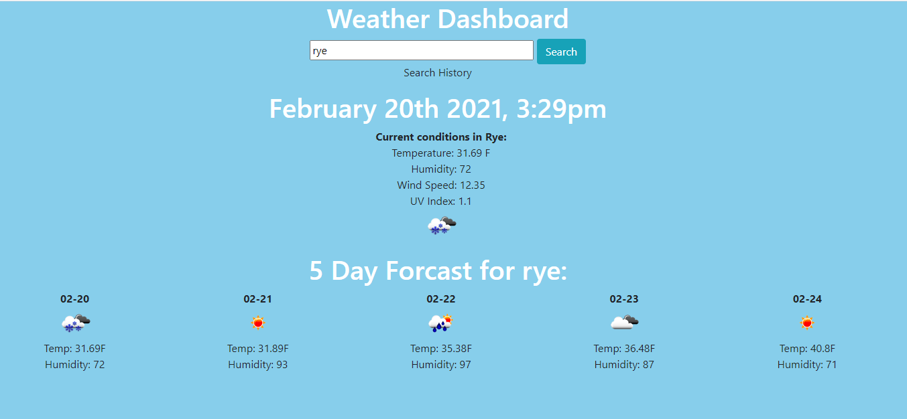

# Weather Dashboard

# Using Open Weather API

The Weather Dashboard is designed so that the user can type in any city and get the current conditions. The temperature, wind speed, humidity, and an icon of the current conditions will appear once the user clicks search. In addition to the current conditions, the future conditions will also be listed below. The future conditions only contain the temperature, humidity, and an icon for the conditions of that day. 

# Tech Used

This application was created using HTML, Javascript, and CSS. I used the BootStrap library to help with styling and page responsiveness. I used the Moment.Js library as well for the time and date. 

